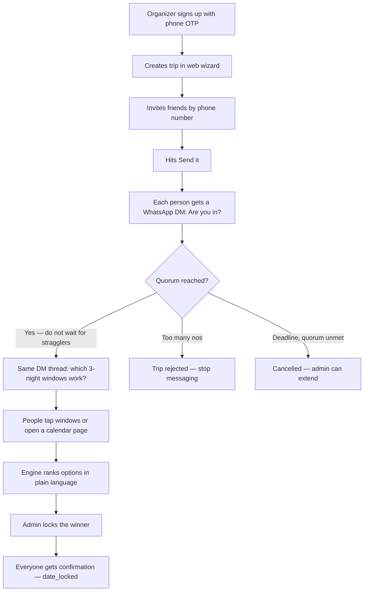

# MakeItHappen — High-level app flow

v1 does one job: take a vague group idea ("Athens in May") and leave the group with **locked dates**. Friends stay in WhatsApp. The organizer uses the web app.

```
WhatsApp = the product          Web app = the cockpit
everyone answers here           organizer creates, watches, locks
```

---

## 1. Two people, two surfaces

| Who | Where they live | What they do |
|---|---|---|
| **Organizer** | Web app | Sign up, create trip, invite, watch progress, lock dates |
| **Everyone else** | WhatsApp 1:1 with MakeItHappen | Tap yes/no, tap date windows. No account. |

Richer actions (pick custom dates) open a **no-login web page** from the WhatsApp message. They still never create an account.

The friends' existing WhatsApp group is **not** used for questions. It is used only if someone ghosts — then a public callout can land there.

---

## 2. Happy path (Athens, 3 nights in May)



That last box is the v1 finish line. Booking and money come later.

---

## 3. What happens in each phase

### Draft — organizer only
Web wizard: title, destination, nights, date window, description, how many yes-votes are enough (**quorum**), who is **essential**, deadline, and how public callouts work (`relay` / `none`; `managed` is later).

Then invite by phone (a display name is required — nudges have to say "Dani", not a number). Hit **Send it**.

### Approval — "are you in?"
Every invitee gets a 1:1 WhatsApp message with buttons: **I'm in** / **Can't** / **Tell me more**.

Rules that keep trips from stalling:

- The moment yes-votes hit quorum → move on. Do not wait for ghosts.
- If so many people said no that quorum is impossible → reject now and stop.
- People who said no are dropped. They get no more messages.
- Someone can change yes → no until the phase closes; that can send the trip back.

### Date collection — "which window?"
The engine proposes a small set of concrete 3-night windows (WhatsApp only allows a few buttons). Tap one, or **Pick my own dates** to paint a calendar.

If someone does not answer, the **nudge ladder** starts (see below).

### Date proposed — "lock it"
Admin sees ranked options with a sentence, not a score:

> May 14–17 works for 7 of 8. Only Dani can't make it.

Admin locks one. If everyone answered and the top option is unanimous, the engine can lock it itself.

### Date locked — done for v1
Everyone gets the confirmation. The group has a real date.

---

## 4. Trip states

```
draft → approval ─┬─► approved → date_collection → date_proposed → date_locked
                  ├─► rejected
                  └─► cancelled

cancelled is reachable from any state (admin).
```

After `date_locked` (not built in v1):

```
date_locked → sourcing → proposal_review → committed
```

---

## 5. If someone ghosts

Questions stay in the 1:1 chat. The group is silent unless escalation needs it.

| After | Where | What |
|---|---|---|
| 24h | Direct DM | Gentle reminder |
| 48h | Direct DM | Personal poke ("6 people are waiting") |
| 72h | Group * | Public standings, names only the people who have not answered |
| 96h | Group * | Affectionate roast |
| 120h | Admin DM | Lock without them, or extend? |

\* Group levels depend on the trip's escalation mode:

- **`relay` (default)** — app writes the callout; admin pastes it into the existing friends group in one tap
- **`none`** — no public naming; firmer DMs instead, then the same admin decision
- **`managed`** — bot posts into a WhatsApp group it created (Phase 2, not v1)

Escalation **stops the moment they answer**. People who already answered are never named.

---

## 6. Who decides what

```
Organizer / admin          Engine                         Participant
─────────────────          ──────                         ───────────
Create trip                Send the right question        Tap I'm in / Can't
Invite people              Advance or fail early          Tap date windows
Choose escalation mode     Nudge ghosts on a schedule     Optional: paint calendar
Lock the dates             Rank windows + explain         (never required to install)
Extend deadline            Queue a group callout
Send the relay callout
```

The organizer is not the project manager. They start it, they lock it, and (in `relay`) they tap send on a callout the app already wrote.

---

## 7. After v1 (designed, not built)

- **Phase 2 — travel sourcing:** search flights/stays, show 2–3 costed options, same approval cycle.
- **Phase 3 — money:** track who owes whom. The app never holds funds.

---

Source of truth for rules, data model, and messaging constraints: [PLAN.md](./PLAN.md).
